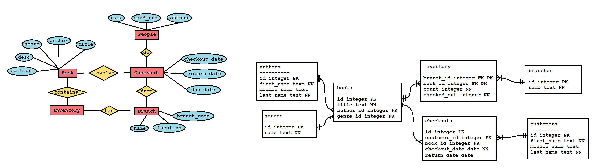

# Library Management Database

This project takes a libary dataset and creates a normalized PostgreSQL database to store the data.

## About the project

There are a number of skills this project seeks to illustrate based around database design and management. The first is normalization: in this project, I design and implement a normalized data schema in PostgreSQL to hold the data from this initial, non-normalized dataset. Second is querying: with the new dataset in place, I illustrate several examples of queries one might run to answer common organizational questions users of the libary database might want to ask. Last is optimization: I show how adding database indexes can be used to optimize commonly performed queries. 

## Navigating the repository

There are five main directories: the root directory and the four inside of it: data, dbsetup, planning, and querying. The data directory holds all code used to generate the initial dataset. The dbsetup folder contains the initial datset as a CSV file and several SQL scripts used to define the normalized schema and import data into it. The planning directory does not hold code, but rather holds leftover artfifacts from the planning stage of the project. The file "erd.png" shows two different entity-relationship diagrams from two-different stages of the planning process, and the file "schema option.txt" holds a version of the schema in text form. All are similar, but not quite equivalent to the schema defined in dbsetup. The last subdirectory is the querying directory which holds two SQL files: the first performs three queries based on three different organizational questions; the second optimizes one of those queries with a database index and illustrates how the index alters the query plan and query execution time. 

 

The root directory contains five files in addition to these subdirectories. The first is this README. The first is .env.example, which contains a template for how a .env file should look in order to successfully build this project. The second is the .gitignore, which prevents Git from tracking .env for security purposes. The third is docker-compose.yml which tells Docker how to launch the PostgreSQL server and how to persist its data. The fourth is UNLICENSE.txt which includes this project's license. The fifth is this README file. The final file is setup.sql which automates the data importing process by calling eveery script in dbsetup. 

## Prerequisities
- Download and Install [Docker](https://www.docker.com/products/docker-desktop/)
- Download and Install [PostgreSQL](https://www.postgresql.org/download/). When the installer asks which components you want to install, you only need to select `Command Line Tools` to install the interactive shell, PSQL.
- Download and Install [Git](https://git-scm.com/install/)

## Project setup

- Clone the project using `git clone https://github.com/sbush111/image-equivalence-model.git`. 

### Launch the server

1. Duplicate the file `.env.example` and rename the duplicate `.env`. Replace `your_username_here` and `your_password_here` with a new username and password of your choosing.

2. Ensure Docker engine is running on your machien with `docker start`.

3. Run `docker compose up` to launch the PostreSQL server.

4. Connect to the server and enter the interactive PSQL shell with the command `psql -U your_username_here -d librarydb`, and enter your password when prompted. Use the username and password you defined in the `.env` file.

### Closing the server

1. Exit the PSQL shell with `\q`, `\quit`, `quit`, or `exit`.

2. Close the server by running `docker compose down`. 

3. If you want to not only close the server, but delete the data in the database, run `docker compose down -v`.

### Setting up the database

1. Launch the server and connect to it with PSQL as described above.

2. Run the setup script with the command `\i setup.sql`.

3. Run the command `\dt` to verify that the tables have been created.

### Querying the database

1. You can enter your own queries directly from the PSQL interactive shell.

2. You can draft your own query script as an .sql file and run it with `\i`.

3. You can run this project's query script by using the command `\i querying/queries.sql`.

4. You can run this project's optimization illustration by using the command `\i querying/optimize.sql`.

## License

This is free and unencumbered software released into the public domain. See UNLICENSE.txt for more information.

## Contact

See https://sean-bush.com for more information.